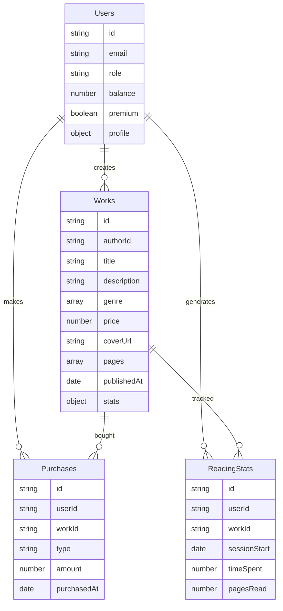

# 3. Architecture

**Généré par :** Architect Cascade

## High Level Architecture
InkUp suit une architecture serverless hybride, combinant frontend multi-plateforme et backend Firebase. Le pattern principal est le Serverless Architecture avec séparation claire entre logique client et serveur. L'app mobile utilise React Native pour iOS/Android, le web utilise Next.js pour SSR/SSG. Le backend repose sur Firebase pour scalabilité et rapidité de développement. Les données circulent via Firestore pour les métadonnées, Storage pour les médias, et Cloud Functions pour la logique métier (paiements, notifications).

## Tech Stack
- **Frontend :** React Native (mobile) + Next.js (web), avec TypeScript pour type safety. Librairies : React Navigation, Zustand pour state management.
- **Backend :** Firebase (serverless) : Auth pour gestion comptes, Firestore pour données, Storage pour images BD, Cloud Functions (Node.js) pour logique (webhooks Stripe, calculs analytics).
- **Base de données :** Firestore (NoSQL document-based) pour flexibilité et realtime updates.
- **Stockage images BD :** Firebase Storage avec optimisation (redimensionnement via Cloud Functions) et sécurité (signed URLs).
- **Paiements :** Stripe pour achats one-time et subscriptions, intégré via Cloud Functions.
- **Sécurité :** Firestore rules, Firebase Auth, anti-capture via obfuscation mobile.
- **Déploiement :** Vercel pour web, Expo/App Store pour mobile.

## Data Models
Interfaces TypeScript pour les entités principales :

```typescript
interface User {
  id: string;
  email: string;
  role: 'reader' | 'author';
  balance: number; // InkPoints
  premium: boolean;
  profile: {
    name: string;
    bio?: string;
    socialLinks?: string[];
  };
}

interface Work {
  id: string;
  authorId: string;
  title: string;
  description: string;
  genre: string[];
  price: number; // en InkPoints pour achat unité
  subscriptionPrice?: number; // pour abo série
  coverUrl: string;
  pages: string[]; // URLs vers Storage
  publishedAt: Date;
  stats: {
    views: number;
    likes: number;
  };
}

interface Purchase {
  id: string;
  userId: string;
  workId: string;
  type: 'unit' | 'pack' | 'subscription';
  amount: number;
  purchasedAt: Date;
}

interface ReadingStat {
  id: string;
  userId: string;
  workId: string;
  sessionStart: Date;
  timeSpent: number; // minutes
  pagesRead: number;
}
```

## Components
- **Mobile App :** Composants pour lecteur (Viewer), dashboard (AuthorPanel), communauté (SocialFeed).
- **Web App :** Pages SSR pour découverte, profil, admin.
- **Shared :** Utils pour auth, cache, API calls.
- **Backend :** Functions pour processPayments, updateStats, sendNotifications.

## External APIs
- **Firebase Auth :** Gestion auth multi-provider.
- **Stripe API :** Création de sessions paiement, webhooks pour crédits InkPoints.
- **Optionnel :** Analytics externes (Google Analytics) pour métriques avancées.

## Core Workflows
1. **Authentification :** User saisit credentials -> Firebase Auth -> Token stocké localement -> Accès aux données.
2. **Lecture BD :** User sélectionne BD -> Vérif achat via Firestore -> Fetch pages depuis Storage -> Affichage avec navigation.
3. **Achat :** User choisit produit -> Débit InkPoints (Cloud Function) -> Si insuffisant, redirect Stripe -> Crédit post-paiement.
4. **Publication Auteur :** Auteur upload fichiers -> Validation -> Stockage dans Firestore/Storage -> Indexation pour découverte.
5. **Communauté :** User poste commentaire -> Firestore realtime -> Notifications push via Cloud Messaging.

## Source Tree
```
src/
├── mobile/ (React Native)
│   ├── components/
│   ├── screens/ (Auth, Reader, Dashboard)
│   └── utils/
├── web/ (Next.js)
│   ├── pages/
│   ├── components/
│   └── lib/
├── shared/
│   ├── models/ (interfaces TS)
│   ├── services/ (API Firebase)
│   └── hooks/
├── functions/ (Firebase Cloud Functions)
│   ├── payments/
│   ├── analytics/
│   └── notifications/
```

## Infrastructure and Deployment
- **Firebase Hosting :** Pour web static.
- **Cloud Run :** Pour functions scalables.
- **Monitoring :** Firebase Crashlytics pour mobile, Sentry pour web.

## Error Handling Strategy
- Erreurs réseau : Retry avec exponential backoff.
- Erreurs paiement : Rollback transactions, notifications user.
- Logs : Cloud Logging pour debugging.

## Testing Strategy and Standards
- Unit tests : Jest pour composants et functions.
- Integration : Firebase emulators pour end-to-end.
- QA : Tests manuels sur devices réels.

## Security
- Auth obligatoire pour données sensibles.
- Chiffrement en transit (HTTPS).
- Firestore rules : Lecture/écriture selon rôles.
- Anti-capture : Obfuscation code mobile, watermark images.

## Schéma de Base de Données


## Stratégie pour le Mode Hors-ligne
Utiliser une approche PWA (Progressive Web App) pour web et mobile :
- **Service Workers :** Cache des ressources statiques (JS, CSS) et dynamiques (images BD via Cache API).
- **IndexedDB :** Stockage local des métadonnées (titres, couvertures, achats) pour navigation offline.
- **Cache API :** Pour images BD, avec stratégie stale-while-revalidate pour updates.
- **Synchronisation :** Background sync via Service Workers pour upload stats lecture lors reconnexion.
- **Limitations :** Contenu premium seulement après achat, pas de streaming en direct.
